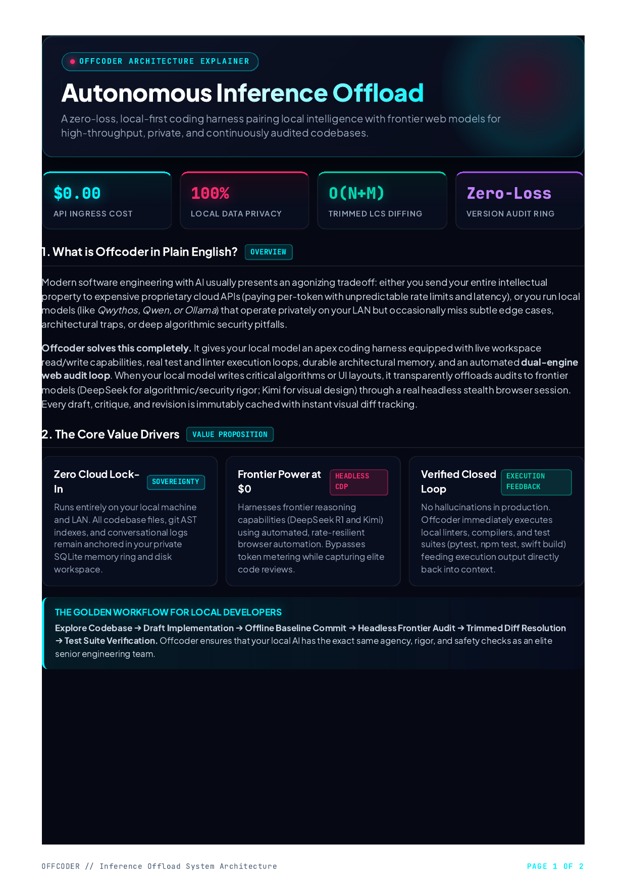
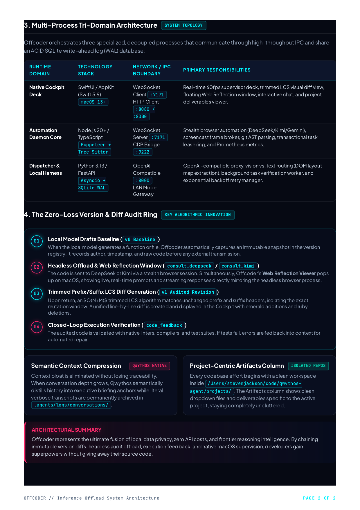
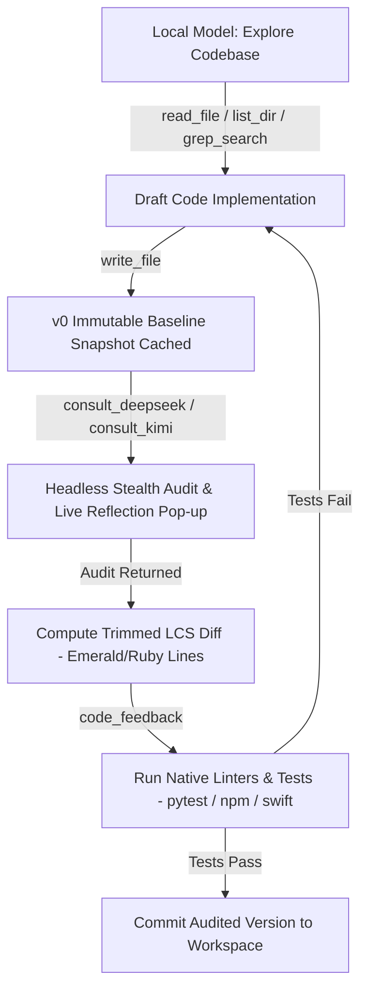

# Offcoder: Autonomous Inference Offload & Zero-Loss Coding Harness

<p align="center">
  
  
</p>

<p align="center">
  <a href="OFFCODER_EXPLAINER.pdf"><b>Download High-Res Architecture Explainer PDF</b></a> &nbsp;|&nbsp; 
  <a href="offcoder-full-with-dependencies.zip"><b>Download Full Bundle (.ZIP)</b></a>
</p>

---

## What is Offcoder? (In Plain English)

Modern AI programming usually forces an agonizing choice:
1. **Send your entire intellectual property to proprietary cloud APIs** (paying recurring per-token bills, dealing with unpredictable rate limits, and surrendering privacy), OR
2. **Run local models (e.g. Qwythos, Qwen, Ollama)** that are private and fast on your LAN, but occasionally miss subtle edge cases, architectural traps, or deep algorithmic security pitfalls.

**Offcoder solves this completely.**

Offcoder gives your local model an **apex coding harness** equipped with live workspace manipulation, real test and linter execution loops, durable architectural memory, and an automated **dual-engine web audit loop**. 

When your local model writes critical algorithms or UI components, it transparently offloads audits to frontier models (**DeepSeek R1** for algorithmic/security rigor; **Kimi** for visual aesthetics) through a real headless stealth browser session. Every draft, critique, and revision is immutably cached with **line-by-line visual diff tracking** and verified with **closed-loop test feedback**.

---

## Key Value Drivers & Solutions

| Value Driver | The Problem in Standard AI Coding | The Offcoder Solution |
| :--- | :--- | :--- |
| **Zero Cloud Lock-In & $0 Cost** | High per-token fees and vendor lock-in with cloud API providers. | Harnesses local model speed on LAN combined with automated headless browser offload to frontier models. **$0.00 ingress API cost.** |
| **100% Data Sovereignty** | Proprietary corporate code sent across third-party remote networks. | All codebase files, git AST indexes, conversation logs, and SQLite WAL records live entirely on your local machine and LAN. |
| **Zero-Loss Version Diff Ring** | AI models silently replace whole files, causing silent regressions. | Automatically commits a **v0 baseline** before external audit, and generates an **$O(N+M)$ trimmed LCS diff** upon audit return. |
| **Live Web Reflection Window** | Developers are blind to what headless agents are doing in background web sessions. | A floating rectangular macOS viewer pops up in real-time, streaming the exact prompts sent and tokens received during headless audits. |
| **Closed-Loop Execution Verification** | AI code compiles in theory but breaks at runtime with syntax/type errors. | Local models trigger `code_feedback` to run native linters, compilers (`tsc`, `swift build`), and tests (`pytest`, `npm test`), feeding errors back for immediate self-correction. |
| **Semantic Context Compression** | Large conversations degrade model focus and exhaust context windows. | Qwythos semantically distills conversational history into concise executive briefings while archiving literal verbose logs to `.agents/logs/conversations/`. |
| **Isolated Project Artifacts** | Unstructured file outputs clutter your primary project folders. | Work on any codebase is isolated in a dedicated project directory (`qwythos-agent/projects/`). The Cockpit's Artifacts column stays clean and focused. |

---

## Tri-Domain Multi-Process Architecture

Offcoder orchestrates three decoupled runtime domains connected via high-speed local IPC and persistent SQLite WAL storage:

```
                      ┌──────────────────────────────────────────────┐
                      │             NATIVE COCKPIT DECK              │
                      │         SwiftUI / AppKit (macOS 13+)         │
                      │  • 60fps Supervision      • Visual Diffs     │
                      │  • Web Reflection Window  • Artifacts Viewer │
                      └───────▲──────────────────────────────▲───────┘
                              │ WS :7171                     │ HTTP :8080
                              │                              │
┌─────────────────────────────▼──────────┐        ┌──────────▼──────────────────────────┐
│         AUTOMATION DAEMON CORE         │        │         LOCAL CODING HARNESS        │
│         Node.js 20+ / TypeScript       │        │         Python / FastAPI Proxy      │
│ • Stealth Browser Automation (CDP:9222)│        │ • Qwythos Coding Harness Tools      │
│ • Tree-Sitter AST & Git Ingestion      │        │ • Vision vs DOM Layout Router       │
│ • Transactional Task Leasing Ring      │        │ • Exponential Backoff Retry Loop    │
└─────────────────────────────▲──────────┘        └──────────▲──────────────────────────┘
                              │                              │
                              └──────────────┬───────────────┘
                                             │ SQLite WAL
                                             ▼
                               ┌───────────────────────────┐
                               │     ~/.local_orchestrator │
                               │           state.db        │
                               └───────────────────────────┘
```

---

## The Golden Developer Workflow



---

## Included Artifacts in this Repository

1. **[OFFCODER_EXPLAINER.pdf](OFFCODER_EXPLAINER.pdf)**: The publication-grade 2-page architectural explainer in Moonpond dark navy, effervescent ruby, and radiant turquoise design.
2. **[offcoder-full-with-dependencies.zip](offcoder-full-with-dependencies.zip)**: A complete, self-contained zip archive containing all source code, tools, configs, and pre-bundled `node_modules` dependencies (59 MB).
3. **[docs/assets/](docs/assets/)**: High-resolution rendered PNG previews of the explainer document for instant visual inspection.
4. **[cockpit/](cockpit/)**: Native SwiftUI macOS cockpit deck.
5. **[daemon/](daemon/)**: Node.js Puppeteer & Tree-sitter orchestration daemon.
6. **[dispatcher/](dispatcher/)**: Python 3.13 FastAPI model gateway and task verification worker.
7. **[mcp-server/](mcp-server/)**: Model Context Protocol (MCP) server for stealth headless audits.

---

## Quickstart

```bash
# 1. Unzip or clone the repository
git clone <repo-url> && cd offcoder

# 2. Launch Google Chrome with dedicated CDP remote debugging profile
./scripts/chrome_launch.sh

# 3. Start the Daemon & Dispatcher
cd daemon && npm install && npm run dev
cd ../dispatcher && python3 -m venv .venv && source .venv/bin/activate && pip install -r requirements.txt && uvicorn src.main:app --port 8000

# 4. Launch the Native SwiftUI Cockpit Deck
cd ../cockpit && swift run
```
